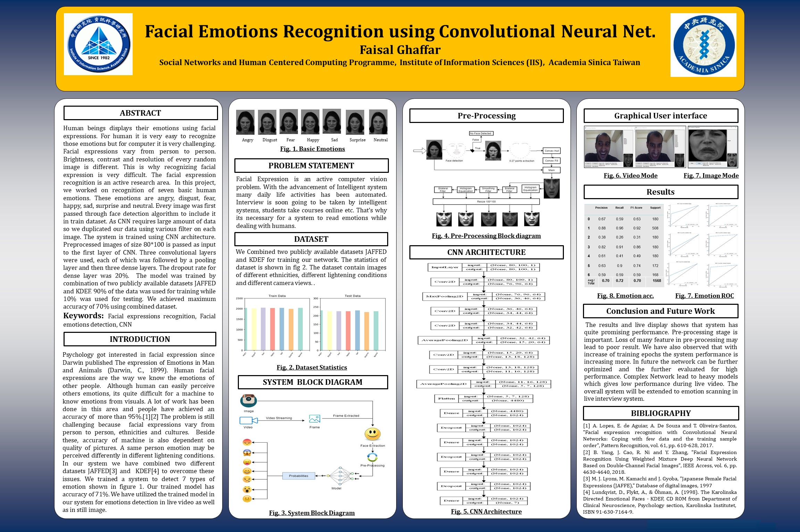

# Facial-Emotion-Recognition
## Deep learning
Abstract— 
Human beings displays their emotions using facial expressions. For human it is very easy to recognize those emotions but for computer it is very challenging. Facial expressions vary from person to person. Brightness, contrast and resolution of every random image is different. This is why recognizing facial expression is very difficult. The facial expression recognition is an active research area.  In this project, we worked on recognition of seven basic human emotions. These emotions are angry, disgust, fear, happy, sad, surprise and neutral. Every image was first passed through face detection algorithm to include it in train dataset. As CNN requires large amount of data so we duplicated our data using various filter on each image. The system is trained using CNN architecture. Preprocessed images of size 80*100 is passed as input to the first layer of CNN. Three convolutional layers were used, each of which was followed by a pooling layer and then three dense layers. The dropout rate for dense layer was 20%.  The model was trained by combination of two publicly available datasets JAFFED and KDEF. 90% of the data was used for training while 10% was used for testing. We achieved maximum accuracy of 78% using combined dataset.
 For details please refer to the [paper](https://128.84.21.199/abs/2001.01456) 

